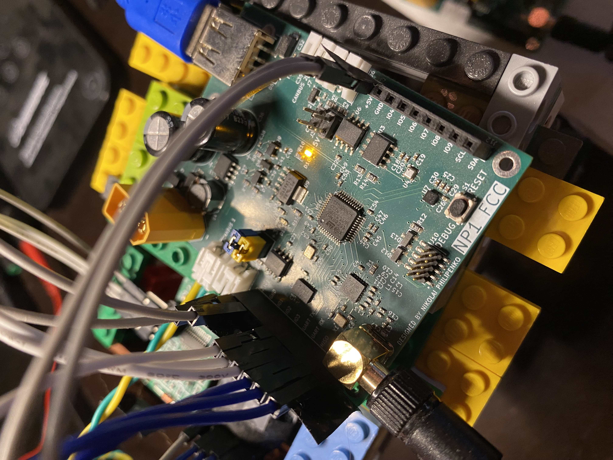
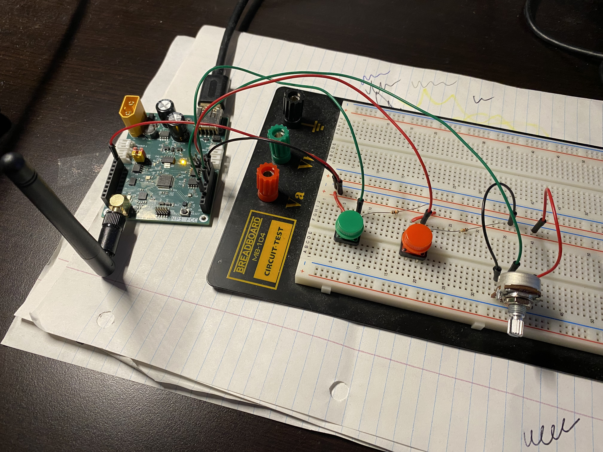
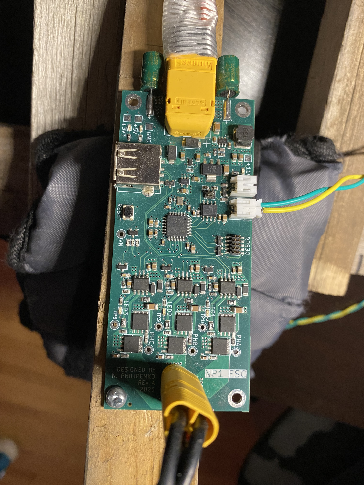
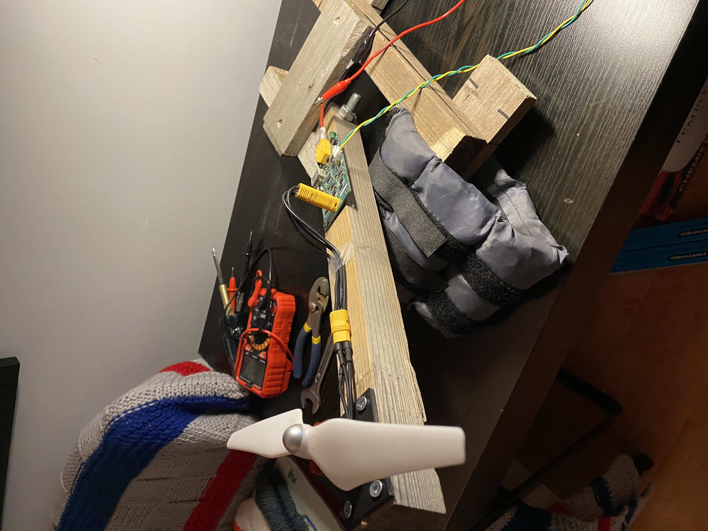

# NP1 DRONE
I am attempting to build a quadcopter from scratch, both the PCB hardware (using KiCAD) and software (C/C++ on STM32).

I am a computer software engineering student at the University of Alberta. I started this project in early 2024 to push myself with embedded systems. Since its inception, I have learned a ton about PCB design and FreeRTOS firmware on STM32 microcontrollers. 

Everything I make in this project is from scratch. The STM32-based circuit boards are designed with KiCAD and ordered from JLCPCB with assembly. I am using FreeRTOS for the software because of its scalability in complex embedded projects. I have written all the device drivers from scratch, and wholely designed the multi-threaded architecture for each of the drone's sub-systems.

Each sub-system presents its own set of challenges. As an overview, there are 3 sub-systems of the NP1 Drone:
```
                     (Over-The-Air Messaging)                               (CANBUS)
[RC CONTROLLER]   <---------------------------->  [Flight Controller]   <--------------->  [Electronic Speed Controller] x4
```
#### 1. Flight Controller Overview
The Flight Controller (FCC) is a custom PCB design whose software runs the control system for the drone. In order to achieve this, it must 1) receive pilot input from the RC Controller, and 2) estimate its attitude and heading (roll, pitch, yaw). These inputs enter the onboard PID controller in order to calculate the necessary motor commands to send to the Electronic Speed Controllers (ESCs).

The FCC is equipped with a multitude of sensors, namely an IMU, magnetometer, barometer, optical flow sensor, and range finder. It performs sensor fusion through the use of an Extended Kalman Filter (EKF) and a few other custom algorithms. When it receives Over-The-Air (OTA) messages from the RC Controller, it monitors for a HEARTBEAT signal to detect LOSS-OF-LINK and perform flight termination. The control system interprets pilot input and sets the target roll, pitch, and yaw accordingly depending on flight mode (various flight modes still WIP).

<p align="center">
  <br>
  <sub><b>Figure 1:</b> The Flight Controller (FCC) sitting on a Lego frame. The USB powers the board and enables logging to my laptop; jumper wires connect the external range finder and optical flow sensor; the green and yellow twisted pair connect to the ESCs using CANBUS.</sub>
</p>

#### 2. RC Controller Overview
The RC Controller is simple: receive pilot input from various joysticks and buttons and send those values Over-The-Air (OTA) to the FCC. A custom OTA messaging protocol (modelled after MAVLINK) has been developed to facilitate this communication. The physical inputs of the RC Controller are fairly WIP right now. Currently, its a breadboard with push-buttons and a potentiometer, (hopefully) soon it will be a PS4 controller.

<p align="center">
  <br>
  <sub><b>Figure 2:</b> The RC Controller, in its current state. Spare hardware is used to capture pilot input.</sub>
</p>

#### 3. Electronic Speed Controller Overview
The Electronic Speed Controller (ESC) requires a strong understanding of Brushless DC (BLDC) motor control. The custom PCB design and software are designed around the (sensorless) 6-Step Trapezoidal control method, where a Back Electromotive Force (BEMF) measurement from the floating motor phase is measured in order to know when to switch the commutation to the next step. In order to perform proper closed-loop control in this method, the motor must be spinning fast enough to generate a sufficient BEMF. I designed the ESC to operate in a software defined state-machine. Here are the states:
1. STAND-BY: ESC is not commanding a rotation of the motor.
2. ARMING: Align-and-Go Step. ESC commands an open-loop ramp up of the motor to obtain sufficient BEMF measurements. Lasts for about 0.8 sec.
3. ARMED: ESC is commanding true closed-loop, 6-Step commutation with BEMF zero-crossing detection.

The ESC receives ARM, DISARM, and THROTTLE CANBUS messages from the FCC to transition between its internal states and increase / decrease motor RPM.

<table align="center">
  <tr>
    <td align="center" valign="top">
      <br>
      <sub><b>Figure 2:</b> The Electronic Speed Controller (ESC), connected to the FCC via CANBUS.</sub>
    </td>
    <td align="center" valign="top">
      <br>
      <sub><b>Figure 3:</b> The motor test stand; an ESC and BLDC motor mounted onto a wooden lever.</sub>
    </td>
  </tr>
</table>

### In-Depth Design
For more detailed design, please see the hardware and software folders.

Here is the [hardware overview](hardware/README.md).

Here is the [software overview](software/STM32/README.md).

### A Note on the Use of AI
When I started the project in 2024, zero AI was used. Now, from 2026 onward, AI is obviously much better. However, this is a PASSION PROJECT. The goal of this project is to LEARN. I will not be able to effectively achieve that goal if I use AI. The intelligence you gain from AI is artificial. Therefore, I write all the code MYSELF. If there are bugs or I want some review / feedback of my work, I will use AI to do so. In this way, AI is the reviewer and I formulate my own thoughts first. 

