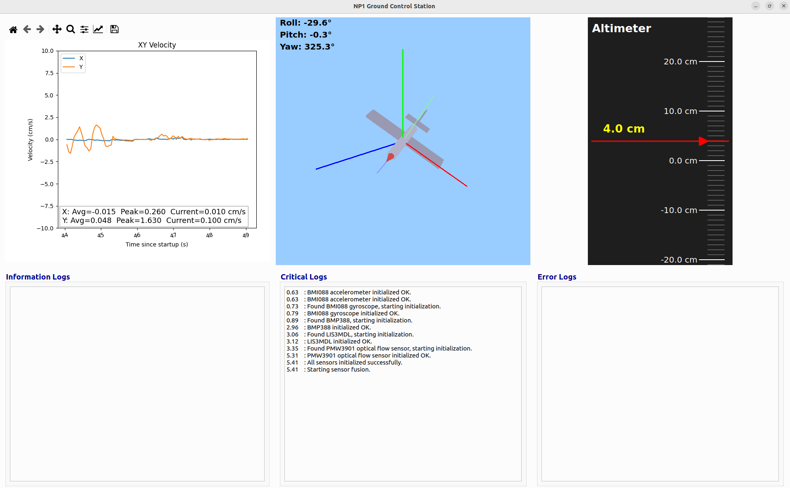

## NP1 Ground Control Station

The NP1 GCS software is a PyQT6 application that reads from a USB serial port that the NP1 FCC is sending vehicle data to. This data is formatted in such a way that the GCS software can parse and display the data into a GUI for visualization. The displayed information includes vehicle state data (XY velocity, current orientation, and altitude) and general logging information.

